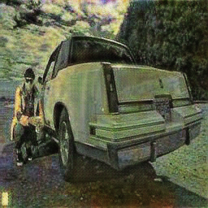
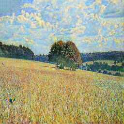

# CycleGAN
Implementation of CycleGAN in PyTorch. This is a slightly modified version of the original paper, so this implementation should be pretty much identical to the paper. The results from this implementation is on par with the paper, Some examples results are included below.

## Results
The model was trained on Real Photo <-> Monet Style Photo dataset.

|1st row: Input    /       2nd row: Generated|
|:---:|
|  |
|  |


### Monet Style Dataset
The dataset can be downloaded from Kaggle: [link](https://www.kaggle.com/c/gan-getting-started/data).
Split the dataset into 2 folders "train" and "val" and add all monet style images inside "monet" folder and the real images inside "real" folder.
The folder tree will look something like this:
```
├── monet_data
│   ├── train
│   │   ├── monet
│   │   └── real
│   ├── val
|   |   ├── monet
|   |   └── real
```

### Training
Edit the config.py file to match the setup you want to use. Then run train.py

## CycleGAN paper
### Unpaired Image-to-Image Translation using Cycle-Consistent Adversarial Networks by Jun-Yan Zhu, Taesung Park, Phillip Isola, Alexei A. Efros

```
@misc{zhu2020unpaired,
      title={Unpaired Image-to-Image Translation using Cycle-Consistent Adversarial Networks}, 
      author={Jun-Yan Zhu and Taesung Park and Phillip Isola and Alexei A. Efros},
      year={2020},
      eprint={1703.10593},
      archivePrefix={arXiv},
      primaryClass={cs.CV}
}
```
